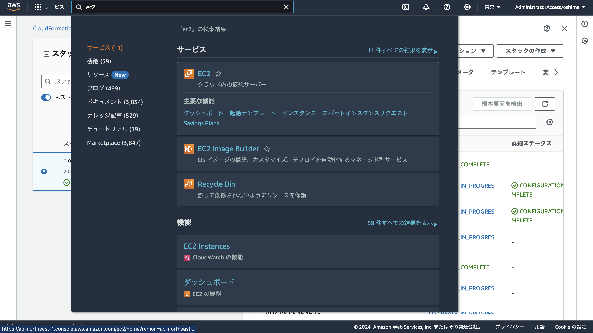
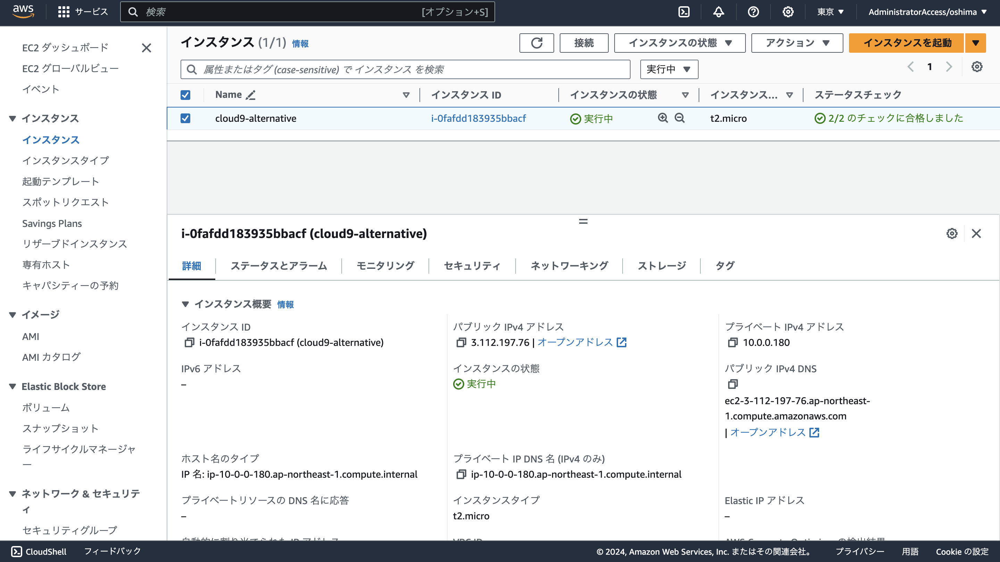
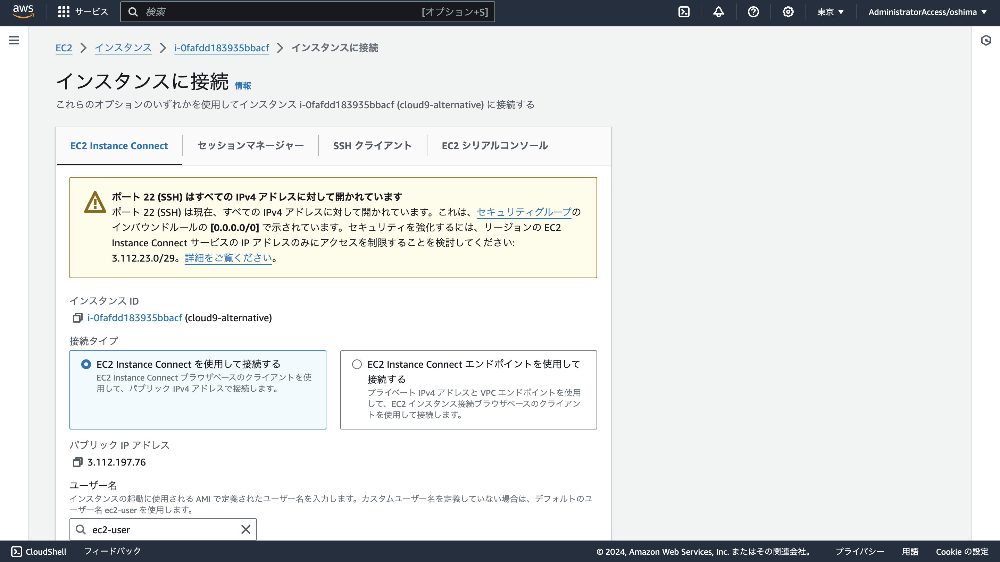
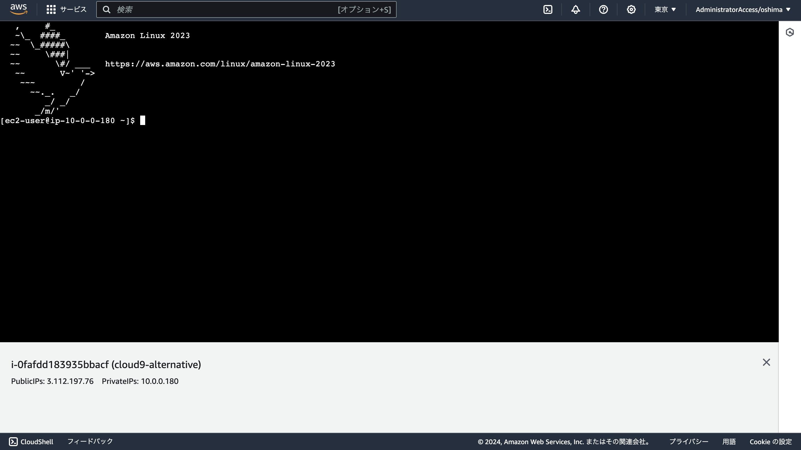

# AWS Cloud9 新規利用終了のための代替環境

このリポジトリでは、AWS 上に Cloud9 の代替となる開発環境を構築するための手順と設定ファイルを公開しています。
AWS Cloud9 の代替として、EC2 インスタンスで [Visual Studio Code Server](https://code.visualstudio.com/docs/remote/vscode-server) を使用します。

> [!WARNING]
> このリポジトリの手順では、デフォルトで t2.micro の EC2 インスタンスを起動します。
> このインスタンスを起動し続けると、1 ヶ月で 10 数ドル程度の料金が発生します。

## 環境構築手順

### 1. CloudFormation スタックの作成

マネジメントコンソール上部の検索欄で「CloudFormation」を検索して開きます。


CloudFormation のホーム画面左のメニューから「スタック」を開き、「スタックの作成」を選択します。


[cloud9-alternative-cloudformation.yaml](cloud9-alternative-cloudformation.yaml) をダウンロードして、「スタックの作成」画面でアップロードして次に進みます。


スタック名を適当につけて、その他の設定はデフォルトのままで、作成まで進めます。
(最後に IAM リソースが作成されることを承認するチェックボックスにチェックが必要です)


しばらくすると、スタックの作成が完了します。


> [!WARNING]
> AWS のハンズオンでは、AWS CLI や CDK、Terraform、Serverless Framework などのツールを使用するために、開発環境に非常に強い権限が必要なことが多いです。
> そこで、この手順で構築される EC2 インスタンスには、AdministratorAccess の権限を付与しています。

### 2. EC2 インスタンスへの接続

マネジメントコンソール上部の検索欄で「EC2」を検索して開きます。



EC2 のホーム画面左のメニューから「インスタンス」を開き、EC2 インスタンスを選択して、上部の「接続」をクリックします。



「EC2 Instance Connect」のタブを選択して「接続」をクリックすると、ブラウザ上で EC2 インスタンスに接続できます。





### 3. Visual Studio Code Server への接続

作成した EC2 インスタンスには、Visual Studio Code がインストール済みです。
以下の手順で、Visual Studio Code Server を起動して接続することができます。

まず、EC2 インスタンスで以下のコマンドを実行して、Visual Studio Code Server を起動します。

```console
code tunnel service install
```

以下のように、メッセージとともにコード (8 桁の英数字) が表示されます。

```
[2024-08-05 05:40:38] info Using GitHub for authentication, run `code tunnel user login --provider <provider>` option to change this.
To grant access to the server, please log into https://github.com/login/device and use code XXXX-XXXX
```

ブラウザの別タブで [https://github.com/login/device](https://github.com/login/device) にアクセスし、GitHub にログインして、ターミナル上に表示されたコードを入力してください。

その後、EC2 Instance Connect の画面に戻り、以下のコマンドを実行してください。

```console
code tunnel
```

すると、以下のように表示されます。

```
*
* Visual Studio Code Server
*
* By using the software, you agree to
* the Visual Studio Code Server License Terms (https://aka.ms/vscode-server-license) and
* the Microsoft Privacy Statement (https://privacy.microsoft.com/en-US/privacystatement).
*
[2024-08-05 05:42:42] info Creating tunnel with the name: XXXXXXXXXXXXXXXXXXXX
[2024-08-05 05:42:42] info
Open this link in your browser https://vscode.dev/tunnel/XXXXXXXXXXXXXXXXXXXX

Connected to an existing tunnel process running on this machine.

Open this link in your browser https://vscode.dev/tunnel/XXXXXXXXXXXXXXXXXXXX
```

最後の行に表示された URL にアクセスして GitHub でログインすると、ブラウザ上で Visual Studio Code が開きます。


## 停止・削除手順

構築した開発環境を使わないときは、「EC2 インスタンスの停止」または「CloudFormation スタックの削除」により、料金を削減することができます。

### EC2 インスタンスの停止手順

マネジメントコンソール上部の検索欄で「EC2」を検索して開きます。

EC2 のホーム画面左のメニューから「インスタンス」を開き、EC2 インスタンスを選択して、「インスタンスの状態」から「インスタンスの停止」を実行します。


> [!WARNING]
> EC2 インスタンスを停止しても、データを保存するストレージ (EBS) は確保したままのため、ストレージの料金は発生し続けます。
> 完全に料金が発生しないようにするには、次の手順で「削除」を実施する必要があります。

### CloudFormation スタックの削除手順

マネジメントコンソール上部の検索欄で「CloudFormation」を検索して開きます。

CloudFormation のホーム画面左のメニューから「スタック」を開き、スタックを選択して、「削除」を実行します。


## [WIP] 補足

### ターミナルの開き方

### Web アプリケーションのプレビュー (ポートの転送)

### Git のインストール

### asdf のインストール

### Node.js のインストール

## トラブルシューティング

### 起動時のスクリプトのログ確認手順

EC2 インスタンスには、起動時のスクリプト (ユーザーデータ) で Visual Studio Code をインストールしています。

`code` コマンドが見つからない場合、以下のコマンドでユーザーデータのログを確認してください。

```console
cat /var/log/cloud-init-output.log
```

### Visualt Stuido Code Server の起動状況・ログ確認手順

`code` コマンドはインストールされているものの、ブラウザから Visual Studio Code に接続できない場合、以下のコマンドで Visual Studio Code Server の起動状況を確認してください。

```console
code tunnel service log
```

## 参考リポジトリ

このリポジトリの環境構築手順は、「[AWS CDK Conference Japan 2024 presented by JAWS-UG コントリビュートワークショップ](https://github.com/jaws-ug-cdk/cdk-conf-2024-contribute-workshop)」のリポジトリを参考にさせていただきました。
