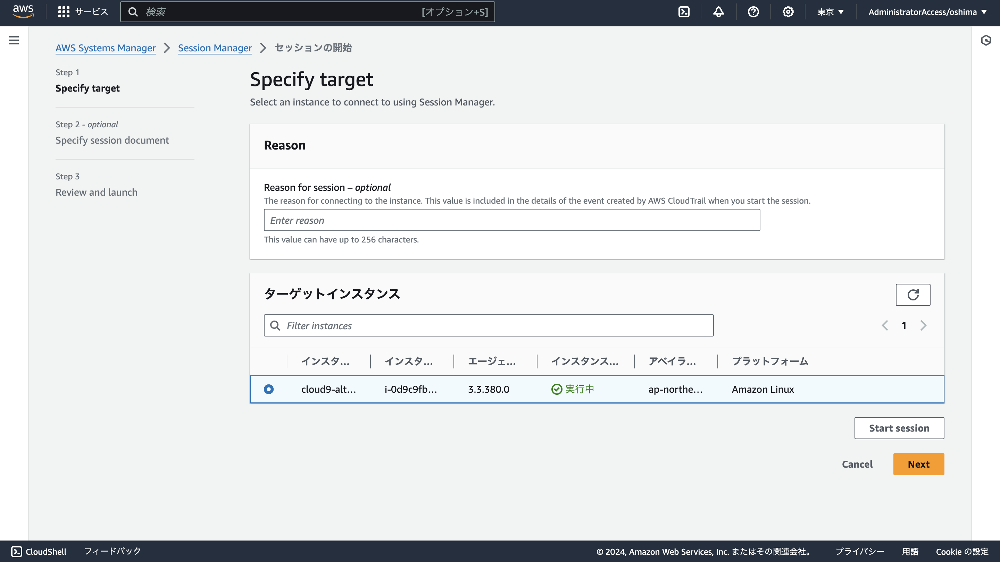

# AWS Cloud9 新規利用終了のための代替環境

このリポジトリでは、AWS 上に Cloud9 の代替となる開発環境を構築するための手順と設定ファイルを公開しています。
AWS Cloud9 の代替として、EC2 インスタンスで [Visual Studio Code Server](https://code.visualstudio.com/docs/remote/vscode-server) を使用します。

> [!WARNING]
> このリポジトリの手順では、デフォルトで t2.micro の EC2 インスタンスを起動します。
> このインスタンスを起動し続けると、1 ヶ月で 10 数ドル程度の料金が発生します。

## 目次

- [環境構築手順](#環境構築手順)
- [トラブルシューティング](#トラブルシューティング)
- [停止・削除手順](#停止・削除手順)
- [基本操作](#基本操作)
- [各種インストール手順](#各種インストール手順)
- [参考リポジトリ](#参考リポジトリ)

## 環境構築手順

### 1. CloudFormation スタックの作成

マネジメントコンソール上部の検索欄で「CloudFormation」を検索して開きます。


> [!NOTE]
> 日本に在住の場合、マネジメントコンソール右上で「東京」リージョンを選択することで、開発環境を快適に使用することができます。

CloudFormation のホーム画面左のメニューから「スタック」を開き、「スタックの作成」を選択します。


[cloud9-alternative-cloudformation.yaml](cloud9-alternative-cloudformation.yaml) をダウンロードして、「スタックの作成」画面でアップロードして次に進みます。


スタック名を適当につけて、その他の設定はデフォルトのままで、作成まで進めます。
(最後に IAM リソースが作成されることを承認するチェックボックスにチェックが必要です)


しばらくすると、スタックの作成が完了します。


> [!WARNING]
> AWS のハンズオンでは、AWS CLI や CDK、Terraform、Serverless Framework などのツールを使用するために、開発環境に非常に強い権限が必要なことが多いです。
> そのため、この手順で構築される EC2 インスタンスには AdministratorAccess の権限を付与しています。

### 2. EC2 インスタンスへの接続

マネジメントコンソール上部の検索欄で「Systems Manager」を検索して開きます。


Systems Manager のホーム画面左のメニューから「セッションマネージャー」を開き、「セッションの開始」をクリックします。


「ターゲットインスタンス」で該当の EC2 インスタンスを選択して、「Start session」をクリックすると、ブラウザ上で EC2 インスタンスに接続できます。




### 3. ユーザーの変更

セッションマネージャーで接続したら、以下のコマンドを実行して、操作中のユーザーを「ec2-user」に変更します。

```console
sudo su - ec2-user
```

ターミナルの表示が以下のようになれば成功です。
(IP アドレスの部分は毎回異なります)

```
[ec2-user@ip-10-0-0-119 ~]$
```


> [!WARNING]
> 次の Visual Studio Code Server に接続するためのコマンドを実行する前に、上記の手順でユーザーを「ec2-user」に切り替える必要があります。

### 4. Visual Studio Code Server への接続

作成した EC2 インスタンスには、Visual Studio Code がインストール済みです。
以下の手順で、Visual Studio Code Server を起動して接続することができます。

まず、EC2 インスタンスで以下のコマンドを実行して、Visual Studio Code Server を起動します。

```console
code tunnel service install
```

以下のように、メッセージとともにコード (8 桁の英数字) が表示されます。

```
[2024-08-05 05:40:38] info Using GitHub for authentication, run `code tunnel user login --provider <provider>` option to change this.
To grant access to the server, please log into https://github.com/login/device and use code XXXX-XXXX
```

ブラウザの別タブで [https://github.com/login/device](https://github.com/login/device) にアクセスし、GitHub にログインして、ターミナル上に表示されたコードを入力してください。

その後、EC2 Instance Connect の画面に戻り、以下のコマンドを実行してください。

```console
code tunnel
```

すると、以下のように表示されます。

```
*
* Visual Studio Code Server
*
* By using the software, you agree to
* the Visual Studio Code Server License Terms (https://aka.ms/vscode-server-license) and
* the Microsoft Privacy Statement (https://privacy.microsoft.com/en-US/privacystatement).
*
[2024-08-05 05:42:42] info Creating tunnel with the name: XXXXXXXXXXXXXXXXXXXX
[2024-08-05 05:42:42] info
Open this link in your browser https://vscode.dev/tunnel/XXXXXXXXXXXXXXXXXXXX

Connected to an existing tunnel process running on this machine.

Open this link in your browser https://vscode.dev/tunnel/XXXXXXXXXXXXXXXXXXXX
```

最後の行に表示された URL にアクセスして GitHub でログインすると、ブラウザ上で Visual Studio Code が開きます。


## トラブルシューティング

### 起動時のスクリプトのログ確認手順

EC2 インスタンスには、起動時のスクリプト (ユーザーデータ) で Visual Studio Code をインストールしています。

`code` コマンドが見つからない場合、以下のコマンドでユーザーデータのログを確認してください。

```console
cat /var/log/cloud-init-output.log
```

### Visualt Stuido Code Server の起動状況・ログ確認手順

`code` コマンドはインストールされているものの、ブラウザから Visual Studio Code に接続できない場合、以下のコマンドで Visual Studio Code Server の起動状況を確認してください。

```console
code tunnel service log
```

## 停止・削除手順

構築した開発環境を使わないときは、「EC2 インスタンスの停止」または「CloudFormation スタックの削除」により、料金を削減することができます。

### EC2 インスタンスの停止手順

マネジメントコンソール上部の検索欄で「EC2」を検索して開きます。

EC2 のホーム画面左のメニューから「インスタンス」を開き、EC2 インスタンスを選択して、「インスタンスの状態」から「インスタンスの停止」を実行します。


> [!WARNING]
> EC2 インスタンスを停止しても、データを保存するストレージ (EBS) は確保したままのため、ストレージの料金は発生し続けます。
> 完全に料金が発生しないようにするには、次の手順で「削除」を実施する必要があります。

### CloudFormation スタックの削除手順

マネジメントコンソール上部の検索欄で「CloudFormation」を検索して開きます。

CloudFormation のホーム画面左のメニューから「スタック」を開き、スタックを選択して、「削除」を実行します。


## 基本操作

### ターミナルの開き方

画面左のメニューボタン (≡) をクリックし、「ターミナル」>「新しいターミナル」でターミナルを開くことができます。


### ディレクトリの開き方

作業用のディレクトリは、ターミナルで `mkdir workspace` のようなコマンドで作成してください。

画面左のメニューボタン (≡) をクリックし、「ファイル」>「フォルダーを開く」で作成したディレクトリを開くことができます。


### ファイルのアップロード

ローカルからファイルをアップロードする際は、エクスプローラー (画面左のファイルのアイコン) を開いて、エクスプローラーを右クリックして「アップロード」を選択してください。


または、エクスプローラーにドラッグ & ドロップすることでもファイルをアップロードできます。

### Web アプリケーションのプレビュー (ポートの転送)

ターミナル上で Web アプリケーション等を起動した場合、ターミナルの右の「ポート」のタブを開いて、「転送されたアドレス」を右クリックし、「ブラウザーで開く」をクリックすると開くことができます。または、画面右下に表示される「ブラウザーで開く」をクリックしてください。


## 各種インストール手順

### Git のインストール

以下のコマンドで Git をインストールできます。

```console
sudo dnf install -y git
```

以下のコマンドで、インストールできたことを確認してください。

```console
git -v
```

### asdf のインストール

Node.js や Terraform などの特定バージョンをインストールしたい際は、[asdf](https://asdf-vm.com/) を使用すると便利です。

以下の公式ドキュメントに従って、「1. 依存関係のインストール」「2. asdf のダウンロード」「3. asdf のインストール」の手順でインストールしてください。

https://asdf-vm.com/ja-jp/guide/getting-started.html

なお、「1. 依存関係のインストール」ではパッケージマネージャが DNF の場合の手順を実施してください。
また、「3. asdf のインストール」では、「Bash & Git」の手順を実施してください。

「3. asdf のインストール」で `~/.bashrc` を編集したら、ターミナルを一度閉じて開き直してください。

以下のコマンドで、インストールできたことを確認してください。

```console
asdf version
```

### Node.js のインストール

asdf を使って Node.js をインストールする手順を以下に示します。

まず、以下のコマンドで Node.js のインストールに必要な OS のパッケージをインストールします。

```console
sudo dnf install -y python3 gcc-c++ make python3-pip
```

参考: https://github.com/nodejs/node/blob/main/BUILDING.md#building-nodejs-on-supported-platforms

続いて、以下のコマンドで asdf の Node.js プラグインをインストールします。

```console
asdf plugin add nodejs
```

作業用のディレクトリに `.tool-versions` というファイルを作成し、インストールしたい Node.js のバージョンを以下のように記述します。

```
nodejs 20.16.0
```


`.tool-versions` を配置したディレクトリで以下のコマンドを実行して、Node.js をインストールします。

```console
asdf install
```

以下のコマンドで、インストールできたことを確認してください。

```console
node -v
```


## Docker のインストール

以下のコマンドで、Docker をインストールします。

```console
sudo dnf update
sudo dnf install -y docker
```

以下のコマンドで Docker を起動します。

```console
sudo systemctl start docker
```

以下のコマンドで Docker コンテナの一覧を表示できます。

```console
sudo docker container ls
```

以下のようにエラーなく一覧が表示されれば、Docker のセットアップは完了です。

```
CONTAINER ID   IMAGE     COMMAND   CREATED   STATUS    PORTS     NAMES
```

> [!WARNING]
> docker コマンドを sudo をつけずに実行できるようにしたい場合は、
> `sudo usermod -a -G docker "$(whoami)"` コマンドを実行したうえで、
> ターミナルを一度閉じて開き直してください。

## 参考リポジトリ

EC2 インスタンスで Visual Studio Code Server を使用する環境の構築は、「[AWS CDK Conference Japan 2024 presented by JAWS-UG コントリビュートワークショップ](https://github.com/jaws-ug-cdk/cdk-conf-2024-contribute-workshop)」のリポジトリを参考にさせていただきました。
